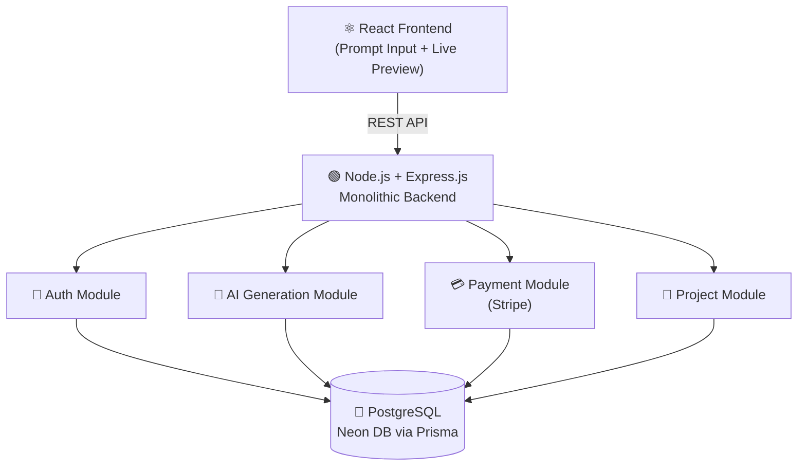
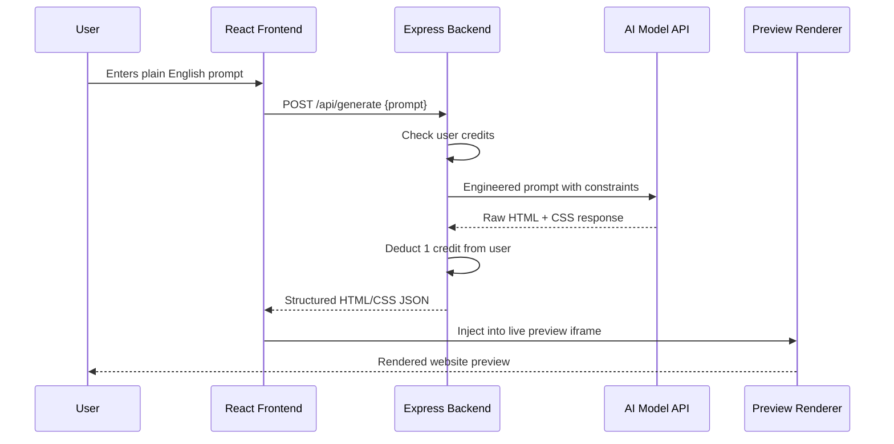
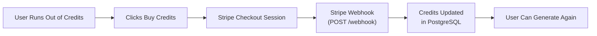
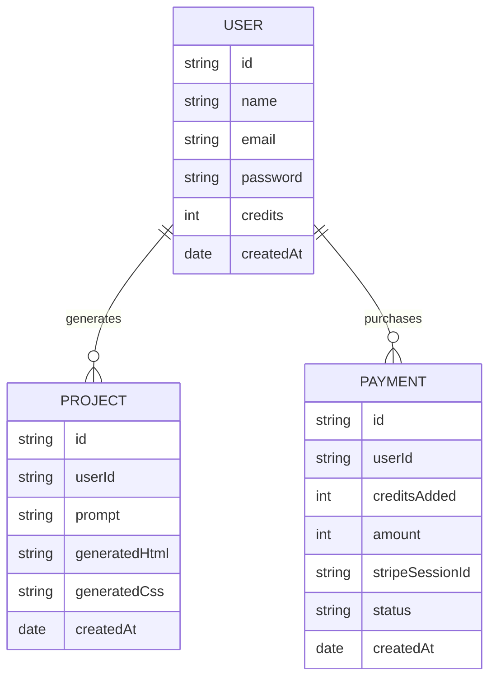

# 🤖 AI Website Builder

An AI-powered full-stack platform that generates **fully functional websites from plain English prompts**. Built with the **PERN Stack + TypeScript** following a **Monolithic Architecture** with modular service layers, a credit-based usage system, and **Stripe payment integration**.

🔗 **GitHub:** [biplab-430/Ai-Site-Builder](https://github.com/biplab-430/Ai-Site-Builder)

---

## 📌 Table of Contents

- [Architecture Overview](#architecture-overview)
- [Why Monolithic Architecture](#why-monolithic-architecture)
- [AI Generation Flow](#ai-generation-flow)
- [Credit & Payment Flow](#credit--payment-flow)
- [Features](#features)
- [Tech Stack](#tech-stack)
- [API Endpoints](#api-endpoints)
- [Database Schema](#database-schema)
- [Getting Started](#getting-started)
- [Environment Variables](#environment-variables)

---

## 🏗️ Architecture Overview

This project follows a **Monolithic Architecture** — a single Express.js server handles all concerns (auth, AI generation, payments, project management) with internally modular service layers.



---

## 💡 Why Monolithic Architecture

| Factor | Monolith (This Project) | Microservices |
|---|---|---|
| Complexity | Low — single deployable unit | High — multiple services |
| Development Speed | Fast | Slower (infra overhead) |
| Best For | Small-medium SaaS apps | Large-scale distributed systems |
| Deployment | Single VPS instance | Multiple containers / Kubernetes |
| Debugging | Easy — single log stream | Harder — distributed tracing |


---

## 🤖 AI Generation Flow



---

## 💳 Credit & Payment Flow



---

## ✅ Features

### 🤖 AI-Powered Generation
- Generate complete websites from **plain English descriptions**
- Supports landing pages, portfolios, product pages, and more
- Real-time **HTML/CSS rendering pipeline** with instant live preview

### 💳 Credit System
- Every generation consumes **1 credit**
- New users receive free starter credits
- Buy more credits via **Stripe payment integration**
- Admin receives payments directly via Stripe dashboard

### 🔐 Authentication
- Secure user registration and login
- Session-based auth with PostgreSQL backend
- Protected routes — generation requires login

### 📦 Project Management
- Save and revisit generated websites
- View full generation history per user
- Regenerate with modified prompts

---

## 🧰 Tech Stack

| Layer | Technology |
|---|---|
| Frontend | React.js, Tailwind CSS, React Router |
| Backend | Node.js, Express.js |
| Database | PostgreSQL (Neon), Prisma ORM |
| Payments | Stripe API + Webhooks |
| AI | Free AI Model API (LLM) |
| Architecture | **Monolithic**, Modular Service Layers |
| Deployment | Hostinger VPS (Backend), Vercel (Frontend) |

---

## 📡 API Endpoints

### Auth Routes — `/api/auth`
| Method | Endpoint | Description | Auth |
|---|---|---|---|
| POST | `/register` | Register new user | ❌ |
| POST | `/login` | Login + session | ❌ |
| GET | `/me` | Get current user + credits | ✅ |

### Generation Routes — `/api/generate`
| Method | Endpoint | Description | Auth |
|---|---|---|---|
| POST | `/` | Generate website from prompt | ✅ |
| GET | `/history` | Get user's past generations | ✅ |

### Payment Routes — `/api/payment`
| Method | Endpoint | Description | Auth |
|---|---|---|---|
| POST | `/create-checkout` | Create Stripe checkout session | ✅ |
| POST | `/webhook` | Stripe webhook — credit top-up | ❌ |

### Project Routes — `/api/projects`
| Method | Endpoint | Description | Auth |
|---|---|---|---|
| GET | `/` | Get all saved projects | ✅ |
| GET | `/:id` | Get single project | ✅ |
| DELETE | `/:id` | Delete a project | ✅ |

---

## 🗄️ Database Schema



---

## 🚀 Getting Started

### Prerequisites
- Node.js v18+
- PostgreSQL (Neon free tier recommended)
- Stripe account
- AI Model API key

### Clone & Install

```bash
git clone https://github.com/biplab-430/Ai-Site-Builder.git
cd Ai-Site-Builder

# Backend
cd server
npm install

# Frontend
cd ../client
npm install
```

### Database Setup

```bash
cd server
npx prisma migrate dev
npx prisma generate
```

### Run the App

```bash
# Backend (from /server)
npm run start

# Frontend (from /client)
npm run dev
```

---

## 🔑 Environment Variables

Create `.env` in `/server`:

```env
PORT=3000
DATABASE_URL=your_neon_postgresql_connection_string

# Auth
JWT_SECRET=your_jwt_secret

# AI Model
AI_API_KEY=your_ai_model_api_key

# Stripe
STRIPE_SECRET_KEY=your_stripe_secret_key
STRIPE_WEBHOOK_SECRET=your_stripe_webhook_secret
STRIPE_PRICE_ID=your_stripe_price_id

NODE_ENV=development
```

Create `.env` in `/client`:

```env
VITE_API_URL=http://localhost:3000
VITE_STRIPE_PUBLIC_KEY=your_stripe_publishable_key
```

---

## 👨‍💻 Author

**Biplab Ghosh**  
B.E. Information Technology | University Institute of Technology, Burdwan  
📧 biplabg966@gmail.com  
🔗 [LinkedIn](https://linkedin.com/in/biplab-ghosh-71132a287) | [GitHub](https://github.com/biplab-430)
